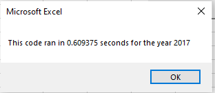

# stock-analysis

##Overview of Project:

  The purpose of this analysis was to determine the total Volume and Percentage Return of different ticker stocks in the years 2017 and 2018 using VBA macros in Excel. The results were determined with one set of code, and then with refactored code, with comparisons drawn between the run time of the intital and refactored code. The usage of loops and formulas were necessary to determine the outputs for the data. The positive and negative returns were highlighted afterwards with the utilization of macros to display results in a clearer format. 

##Results:

  The results for ticker returns were determined utilizing the following code: Cells(4 + i, 3).Value = tickerEndingPrices(i) / tickerStartingPrices(i) - 1, with i representing the rows 0-11.  The stocks performed much better in 2017, seeing positive returns with all tickers except for TERP, which had a negative return of 7.2%. Some of the stock tickers were highly successful, gaining over 100% return. These tickers included DQ, ENPH, FSLR, and SEDG, which had returns of 199.4%, 129.5%, 101.3%, and 184.5% respectively. 
The results for the 2017 stock tickers are displayed below:
                                                                                                                                                                                                                                                                                                                                                                                                                                                                                                                                                                                                                                                                                                                                                                                            

  
  In 2018, meanwhile, the results for the stock tickers were very disappointing. All stocks, except for ENPH amd RUN, had negative returns. ENPH and RUN had positive returns of 81.9% and 84% respectively. The results for the year 2018 are displayed below:
                                                                                                                                                                                                                                                                                                                                                                                                                                                                                                                                                                                                        
                                                                                                                                                                                                                                                                                                                                                                                                                                                                                                                                                                                                        
                                                                                                                                                                                                                                                                                                                                                                                                                                                                                                                                                                                         
  The execution times for the initial script were higher than they were for the refactored script. The initial script run time for 2017 was 4.53 seconds/ The image of the run time is displayed below: 
                    
                                                                                                                                                                                                                                                                 

  The run time for the initial script in 2018 was 4.45 seconds. The image for the run time is displayed below:
                                                                                                                                                                                                                                                                                                                                                                                                    

  
  
  The run time for the refactored script in 2017 was 0.61 seconds. The image for the run time is displayed below:
                                                                                                                                                                                                                                                                                                                                                                                                    

  
  
  The run time for the refactored script in 2018 was 0.59 seconds. The image for the run time is displayed below:
                               
   
   
   

##Summary:

 The advantage of refactoring the code is that allows one to conduct the analysis using a lot less code. The negative aspect of refactoring the code is that one has to spend time integrating code to make the analysis faster when already working code exists. Integration of the code for refactoring is not always intuitive and can still take a lot of time, which can occasionally defeat the purpose of refactoring in the first place. The advantage of refactoring the code was that it allowed one to do the same analysis with a lot less code, and run the analysis at a faster speed.
 
